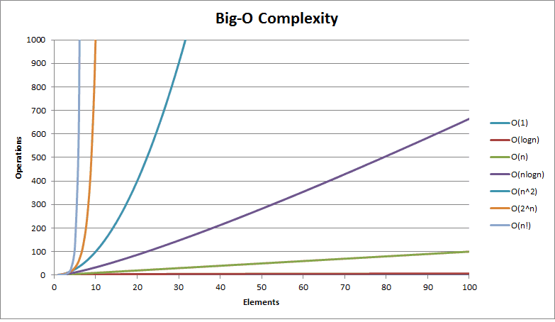

# Mentre codificate

Scrivere codice non deve essere un processo puramente meccanico. Ogni decisione che prendiamo deve essere studiata e ragionata attentamente se si vuole che il programma risultante goda di una vita lunga, precisa e produttiva. In questo capitolo affronteremo le tecniche da utilizzare mentre si codifica.

### Programmazione per coincidenza

Spesso quando codifichiamo scriviamo interi pezzi di codice in maniera meccanica, senza ragionare troppo su ciò che stiamo scrivendo. Questo tipo di _**programmazione per coincidenza**_, basata sulla fortuna e sui successi accidentali, rischia però di mandare in frantumi il nostro programma. Nel momento in cui si verificherà un errore nel nostro codice passeremo ore nel cercare di risolvere il problema, non tanto perché si tratta di un errore difficile da sistemare, ma più che altro perché abbiamo scritto codice senza ragionare, senza sapere del perché prima funzionava.

### Incidenti di implementazione

Supponiamo che inconsapevolmente chiamate un metodo con dei dati errati. Il metodo risponde in un certo modo e allora continuate a codificare in funzione della risposta ricevuta. Il codice apparentemente sembra che funzioni, ma nel momento in cui l'autore del metodo sistema il corpo della routine per rispondere con un'eccezione nel caso in cui riceve dei dati errati, il vostro codice non funziona più. Questo succede quando si chiamano altri metodi senza avere ben chiaro ciò che ci serve e ciò che quel metodo ci restituisce. Quando qualcosa funziona è facile farsi ingannare dal ragionamento: "Adesso funziona, meglio lasciarlo stare...". Ci sono però alcuni motivi validi per ricontrollare quello che si è scritto:

* Può essere che non funzioni davvero, ma che sia solo un caso.
* In circostanze diverse potrebbe comportarsi in un altro modo.
* Un comportamento non documentato potrebbe cambiare con la successiva versione della libreria.
* Chiamate aggiuntive non necessarie rallentano il codice.
* Chiamate aggiuntive potrebbero anche far aumentare il rischio di introdurre nuovi errori.

### Assunzioni implicite

Mentre si codifica è facile dare per assodato determinate cose. Magari date per assodato che un ordine deve avere un cliente associato o che l'utente registrato sia maggiorenne perché nell'interfaccia grafica era obbligatorio inserire un'età non inferiore ai 18 anni. Queste assunzioni implicite possono provocare degli errori inaspettati, pertanto se assumete che qualcosa deve essere in un certa maniera, dimostratelo! Potete utilizzare le asserzioni o i contratti per farlo \(vedi _Design by Contract_\).

### Come programmare consapevolmente

Ecco dei consigli utili per programmare consapevolmente:

* Siate sempre consapevoli di quello che state facendo.
* Non codificate alla cieca. Non tentate di costruire un'applicazione senza capire fino in fondo cosa deve fare e il perché quello che avete fatto funziona.
* Non dovete dipendere dal caso o da ipotesi.
* Documentate i vostri presupposti. L'utilizzo dei contratti \(_Design by Contract_\) può aiutarvi in tutto ciò.
* Dimostrate che le vostre assunzioni sono corrette. L'utilizzo delle asserzioni può aiutarvi nel fare ciò.
* Dedicate tempo agli aspetti più importanti dell'applicazione.
* Non lasciate che il codice esistente vincoli il codice futuro. Se qualcosa non va nel vostro codice, rifattorizzatelo.

### Velocità degli algoritmi

Mentre codifichiamo è molto importante stimare le risorse utilizzate dai nostri algoritmi: tempo, processore, memoria e così via. Per farlo possiamo fare affidamento alla notazione **big O**.

### Che cosa si intende per stima degli algoritmi?

La maggior parte degli algoritmi gestisce qualche tipo di input variabile: ordinamento di _n_ stringhe, inversione di una matrice _m_ x _n_ e così via. Normalmente le dimensioni dell'input avranno un influsso sull'algoritmo: quanto più grande è l'input tanto maggiore sarà il tempo di esecuzione o la quantità di memoria utilizzata. Purtroppo però non sempre è tutto così lineare. Le risorse utilizzate variano oltre che in base alla dimensione dell'input anche in base al tipo di algoritmo. Pertanto è importante la notazione _O\(\)_ o _big O_, la quale ci aiuta a stimare la velocità degli algoritmi.

### La notazione O\(\)

La notazione O\(\) è un modo di esprimere le approssimazioni in forma matematica. Quando scriviamo che un metodo ordina _n_ record in tempo O\(n^2\) vogliamo dire che il tempo necessario nel caso peggiore varierà con il quadrato di _n_.

#### Alcune notazioni O\(\) di uso comune

| **Espressione** | **Utilizzo** |
| :--- | :--- |
| **O\(1\)** | Costante \(accesso a un elemento di un array\) |
| **O\(lg\(n\)\)** | Logaritmico \(ricerca binaria\) |
| **O\(n\)** | Lineare \(ricerca sequenziale\) |
| **O\(n\*lg\(n\)\)** | Un po' peggio che lineare \(es. quicksort, headsort\) |
| **O\(n^2\)** | Quadratica \(ordinamenti per selezione e inserzione\) |
| **O\(n^3\)** | Cubica \(prodotto di due matrici m X n\) |
| **O\(C^n\)** | Esponenziale \(partizionamento di un insieme\) |

Supponiamo di avere un metodo che impiega 1 secondo per elaborare 100 record. Quanto tempo ci vorrà perché ne elabori 1000? Se il codice è O\(1\), ci vorrà sempre 1 secondo. Se è O\(lg\(n\)\) ci vorrà 3 secondi. O\(n\) vi darà un aumento a 10 secondi, mentre O\(n\*lg\(n\)\) vi porterà a 33 secondi. Se avete un algoritmo O\(n^2\), allora ci vorranno 100 secondi.

### Stima a buon senso

Ecco alcuni esempi di stime degli algoritmi:

* **Cicli semplici**: se un ciclo semplice va da 1 a _n_, allora è probabile che l'algoritmo sia O\(n\) - il tempo cresce linearmente con _n_.
* **Cicli annidati**: se si annida un ciclo all'interno di un altro, l'algoritmo diventa O\(n^2\). Un esempio è l'algoritmo di ordinamento _bubble sort_.
* **Processo dicotomico**: se il vostro algoritmo dimezza l'insieme delle cose che prende in considerazione ogni volta che percorre il ciclo, allora è probabile che sia logaritmico O\(lg\(n\)\).
* **Divide et impera**: algoritmi che dividono il loro input lavorando sulle due metà in maniera indipendente e poi combinano i risultati possono essere O\(n\*lg\(n\)\).
* **Combinatoria**: gli algoritmi basati sul calcolo delle combinazioni crescono in maniera esponenziale O\(C^n\). Un esempio può essere la disposizione ottimale degli oggetti in un contenitore.

### La velocità degli algoritmi in pratica

Se i valori di input della vostra routine sono limitati, allora potete avere già un'idea di quanto tempo impiegherà a svolgere l'elaborazione. Se i valori di input dipendono da fattori esterni \(per esempio i record di un database\), allora potete utilizzare la notazione O\(\) per misurare la velocità del vostro algoritmo. Se avete un algoritmo O\(n^2\) cercate un metodo _divide et impera_ che vi faccia scendere a O\(n\*lg\(n\)\). Effettuate dei test per verificare, in base ad input diversi, la velocità del vostro algoritmo e rappresentate in un grafico i risultati. In questo modo dovreste avere un'idea chiara di quale algoritmo utilizzare.

### Più veloce non significa che è il migliore

Non sempre l'algoritmo più veloce è il migliore per quello che si deve fare. Se avete un insieme di input piccolo, allora è inutile che investite tempo nello scrivere un algoritmo super performante. Fate anche attenzione **all'ottimizzazione prematura**. E' sempre meglio essere sicuri che un algoritmo sia un collo di bottiglia prima di investire del tempo prezioso per migliorarlo.

### Refactoring

Con l'evoluzione di un programma si renderà necessario ripensare decisioni prese in precedenza e rielaborare parti del codice. E' un processo del tutto naturale in programmazione. Con il termine **refactoring** si indicano tutte quelle attività che comportano la riscrittura e la ristrutturazione del codice.

### Refactoring: quando?

Quando vi imbattete con del codice che vi colpisce come "sbagliato" non esitate a cambiarlo. Sono molte le cose che possono spingere a un refactoring:

* **Duplicazione**: avete scoperto una violazione del principio DRY.
* **Progettazione non ortogonale**: avete scoperto del codice che potrebbe essere reso più ortogonale.
* **Conoscenza obsoleta**: i requisiti cambiano e la vostra conoscenza del problema migliora. Il codice deve essere sempre all'altezza.
* **Prestazioni**: dovete spostare una funzionalità per migliorare le prestazioni del sistema.
* **Leggibilità**: avete scoperto del codice poco leggibile.

Il refactoring del codice è in realtà un esercizio di **gestione del dolore**. Molti sviluppatori sono riluttanti a fare a pezzi il loro codice, ma migliorare il codice oggi può risparmiare parecchi grattacapi domani.

### Complicazioni del mondo reale

Purtroppo il managment è troppo spesso contrario alla ristrutturazione del codice soprattutto se il tempo stringe e la data di scadenza è ormai alle porte. Tuttavia dovete cercare di imporvi e di far capire l'importanza del refactoring. E' sempre meno doloroso \(e pericoloso\) apportare una piccola modifica oggi che una grossa ristrutturazione domani.

### Come si procede al refactoring

Il refactoring è un'attività che deve essere intrapresa lentamente facendo molta attenzione. Martin Fowler offre alcuni semplici suggerimenti su come effettuare il refactoring senza fare troppi danni:

* Non tentate di effettuare il refactoring e di aggiungere funzionalità allo stesso tempo.
* Assicuratevi di avere dei buoni test prima di effettuare il refactoring. Eseguite i test il più spesso possibile.
* Fate passi brevi: spostate un campo da una classe ad un'altra, spostate un metodo all'interno della superclasse ecc. Se procedete per piccoli passi ed eseguite test dopo ogni passo eviterete un lungo debug.

N.d.A: consiglio la consultazione di questo link per scoprire tutti i segreti del refactoring: [https://sourcemaking.com/refactoring](https://sourcemaking.com/refactoring). 

Un libro invece che consiglio è _Refactoring: Improving the Design of Existing Code_ di Martin Fowler  — ISBN: 978-0134757599

### Codice facile da sottoporre a test

Un altro aspetto importante mentre si codifica è la collaudabilità del software. Avere un sistema di test ci aiuta a scrivere codice più robusto e riusabile.

### Unit test

Uno **unit test** non è altro che codice che mette alla prova un modulo \(o classe\). Gli unit test ci consentono di collaudare il funzionamento dei metodi presenti all'interno di un modulo. In questa maniera siamo sicuri che quel modulo faccia ciò che ci aspettiamo. In seguito, una volta testati i singoli moduli, possiamo anche creare dei test che collaudano interi flussi, quel tipo di test vengono definiti **test di integrazione** \(_integration test_\).

### Test rispetto al contratto

Gli unit test possiamo definirli anche come **test rispetto al contratto** \(vedi _Design by Contract_\). Vogliamo scrivere test che ci garantiscano che un metodo onora il suo contratto e questo ci dirà due cose: se il codice rispetta il contratto e se il contratto significa ciò che pensiamo significhi. In sintesi vogliamo assicurarci che il modulo fornisca proprio le funzionalità che promette. Questa procedura può sembrare overkill, ma ci assicura di risolvere gli errori prima ancora che si verificano.

### Scrivere unit test

Gli unit test devono essere collocati in una posizione facilmente accessibile. Consiglio di creare una directory _tests_ all'interno del progetto dove inserire tutti gli unit test. Poiché l'esecuzione dei test è un'operazione ricorrente, essi devono poter essere eseguiti facilmente, fortunatamente i moderni IDE consentono l'esecuzione dei test con un semplice click. Rendendo facilmente accessibile il codice di test fornite agli sviluppatori che possono usare il vostro codice due risorse preziose:

* Esempi di come usare tutte le funzionalità del vostro modulo.
* Un mezzo per costruire test di regressione e validare qualsiasi futuro cambiamento nel codice.

