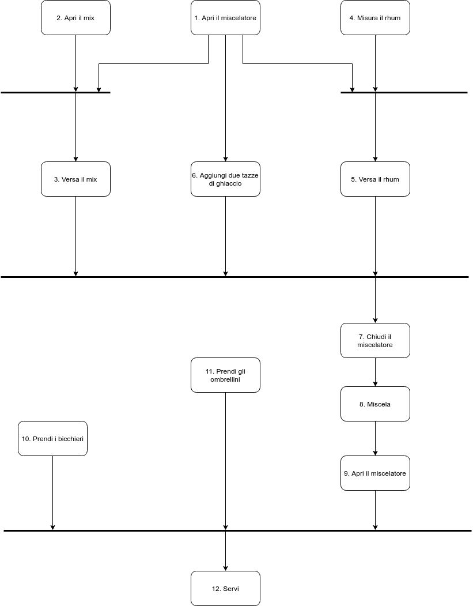
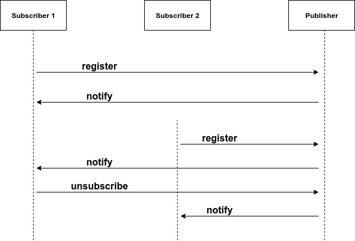

# Piegarsi o spezzarsi

Il codice che scriviamo è soggetto a continue modifiche. L'introduzione di nuove funzionalità o cambiamenti a vecchi requisiti, spesso, portano i progetti fragili a collassare. In questo capitolo vedremo alcune tecniche che ci consentono di scrivere codice più flessibile e aperto alle modifiche.

### Disaccoppiamento e legge di Demetra

Nei capitoli precedenti abbiamo più volte parlato di codice "timido". La timidezza di un modulo \(o classe\) si può ottenere non rilevando troppe informazioni sul modulo e quindi mantenendo alto l'incapsulamento e evitando di interagire con troppi moduli.

### Ridurre al minimo l'accoppiamento

Quando codifichiamo dobbiamo stare attenti alle dipendenze fra moduli e a come questi moduli interagiscono tra di loro. Se chiediamo a un oggetto di _fare qualcosa_, allora vogliamo che quell'oggetto faccia quel qualcosa per conto nostro. Non vogliamo che l'oggetto ci rifili un terzo oggetto con cui interaggire per ottenere ciò che ci serve. Per esempio: immaginate che dovete scrivere una classe che genera un grafico a partire da dei dati di un sensore. Questi dati vengono registrati da oggetti _Recorder_, i quali contengono al loro interno un oggetto _Location_ che dà la posizione e il fuso orario della registrazione. Volete dare ai vostri utenti la possibilità di selezionare un sensore e di ottenere un grafico dei suoi dati etichettato con il fuso orario corretto:

```text
public void plotDate(Date aDate, Selection aSelection) {
    TimeZone tz = aSelection.getRecorder().getLocation().getTimezone();
}
```

Il codice sopra riportato non va bene, perché aumenta il rischio che un cambiamento apportato da qualche altra parte \(es. in _Location_\) vada ad influenzare parti di codice non interessate. Invece di navigare tra gli oggetti possiamo scrivere:

```text
public void plotDate(Date aDate, TimeZone tz) {
    // ...
}

plotDate(someDate, someSelection.getTimeZone());
```

Abbiamo aggiunto a _Selection_ un metodo per recuperare il fuso orario. Al metodo _plotDate_, che si occupa di disegnare il grafico, non interessa come viene passato il fuso orario. Percorrere direttamente l'albero delle dipendenze fra oggetti può portare alle seguenti situazioni:

* Cambiamenti semplici ad un modulo possono propagarsi sugli altri moduli.
* Gli sviluppatori hanno paura a modificare il codice perché non sono sicuri di cosa potrebbe influenzare.

Sistemi con molte dipendenze non necessarie sono molto difficili da manutenere e tendono a essere molto instabili.

### La legge di Demetra per le funzioni

La _legge di Demetra_ dice che un modulo non dovrebbe conoscere i dettagli degli oggetti che manipola. Significa che un oggetto non dovrebbe mostrare la propria struttura interna tramite i metodi d'accesso, perché ciò vorrebbe dire esporre e non nascondere la propria struttura interna. Nello specifico la legge di Demetra dice che un metodo _f_ di una classe _C_ dovrebbe richiamare solo i metodi di:

* C
* un oggetto creato da f
* un oggetto passato come argomento a f
* un oggetto contenuto in una variabile di istanza di C

L'uso della legge di Demetra renderà il vostro codice più robusto e flessibile, ma con un costo: il vostro modulo deve delegare le operazioni agli altri moduli. In pratica questo significa che dovrete scrivere tanti metodi wrapper, i quali semplicemente inoltreranno la richiesta ad un altro modulo \([**Middle Man**](https://sourcemaking.com/refactoring/smells/middle-man)\). Come per ogni cosa dovete bilanciare pro e contro per la vostra applicazione. In alcuni casi potreste scegliere di non rispettare la legge di Demetra e accoppiare strettamente i vostri moduli.

### Metaprogrammazione

Ogni volta che dobbiamo entrare nel nostro codice per apportare qualche modifica corriamo il rischio di rompere il sistema e di introdurre un nuovo errore. Tuttavia, per evitare di cambiare troppo spesso il codice, possiamo rendere il nostro sistema configurabile.

### Configurazione dinamica

Possiamo rendere il nostro sistema configurabile non soltanto a livello di interfaccia utente, come colori e testi, ma anche a livello di algoritmi da utilizzare, database e molto altro ancora. Usate i **metadati** per descrivere opzioni di configurazione per un'applicazione. Normalmente ai metadati si accede e li si usa al momento dell'esecuzione, non in quello della compilazione. In Windows si usano o dei file di inizializzazione \(i cosidetti file .ini\) o voci nel Registro di sistema. Java usa file Property. PHP fa affidamento alle variabili d'ambiente o a file .xml o .yml. Qualunque sia il loro formato, usate i metadati per modificare il comportamento del vostro sistema.

### Applicazioni guidate dai metadati

L'utilizzo dei metadati ci porta a creare programmi dinamici e flessibili. La regola generale è: programmate per astrazione, ovvero per il caso generale, e mettete le specifiche all'interno dei metadati. I vantaggi sono i seguenti:

* Disaccoppiate la vostra applicazione rendendola più dinamica e flessibile.
* Potete personalizzare l'applicazione senza ricompilarla.
* Potete anche essere in grado di implementare più progetti diversi utilizzando lo stesso motore applicativo, ma con metadati diversi.

### Accoppiamento temporale

Quando progettiamo un'architettura o scriviamo un programma pensiamo in maniera fin troppo lineare alle azioni da far compiere al nostro programma: _fai questo_ e poi, dopo che hai finito, _fai quest'altro_. Pensare in questo modo però porta **all'accoppiamento temporale**.

### Flusso di lavoro

In molti progetti potrebbe essere utile descrivere il flusso di lavoro tramite l'utilizzo di **diagrammi di attività UML**, così da scoprire cosa può succedere contemporaneamente e cosa deve succedere in un ordine ben definito. Un diagramma di attività è costituito da un insieme di azioni disegnate come rettangoli. La freccia che esce da un'azione porta a un'altra azione \(che può iniziare una volta completata la prima\) o a una linea spessa chiamata **barra di sincronizzazione**. Quando **tutte** le azioni che portano a una barra di sincronizzazione sono complete, si può procedere seguendo una delle frecce che escono dalla barra. Un'azione verso cui non punta alcuna freccia può essere avviata in qualsiasi momento.

### Preparazione di una Piña Colada

Per preparare una Piña Colada è necessario eseguire le seguenti azioni:

1. Apri il miscelatore
2. Apri una confezione di Piña Colada
3. Metti la Piña Colada nel miscelatore
4. Misura 1/2 tazza di rhum bianco
5. Versa il rhum
6. Aggiungi 2 tazze di ghiaccio
7. Chiudi il miscelatore
8. Miscela per 2 minuti
9. Apri il miscelatore
10. Prendi i bicchieri
11. Aggiungi degli ombrellini
12. Servi

Queste azioni si possono compiere una dietro l'altro, ma possiamo anche ottimizzare i tempi individuando quali azioni possiamo compiere contemporaneamente:



### Architettura

Un modo per ottenere il disaccoppiamento temporale potrebbe essere quello dell'utilizzo delle code di lavoro \(_work queue_\). Immaginate che avete un'applicazione che, data una lista di utenti, si occuppa dell'invio di newsletter. Invece di inviare le email in maniera sincrona nel seguente modo:

1. Recupera l'utente dalla lista
2. Invia l'utente al servizio che si occupa di inviare la newsletter
3. Il servizio costruisce l'email con le informazioni dell'utente
4. Il servizio invia l'email all'utente

Possiamo creare una **coda di messaggi** \(_message queue_\). In pratica il nostro servizio si occupa semplicemente di aggiungere ad una coda di messaggi gli utenti che devono ricevere l'email. Successivamente ci sarà un servizio **consumatore** \(_consumer_\) che in maniera asincrona si occuperà di leggere gli utenti da questa coda e di inviare loro l'email. Si potrebbe anche pensare di avere più servizi consumatori che leggano dalla coda di messaggi, così da velocizzare il processo di invio. In questa maniera il nostro codice sarà più flessibile, più veloce e non sarà accoppiato temporalmente.

### Progettazione per la concorrenza

Progettare software avendo in mente la concorrenza dei dati \(come si farebbe in un'applicazione multithread\) ci aiuta anche a definire interfacce più pulite. Prendete il metodo _strtok_ di C, il quale, dato un delimitatore, ci permette di suddividere una stringa. Il metodo _strtok_ non è thread safe \(usa dati statici per mantenere la posizione corrente nel buffer\). Dovete fare la prima chiamata a _strtok_ con la variabile che volete analizzare e tutte le chiamate successive, invece, con un _null._ Se passate un valore diverso da _null_ il metodo riavvia l'analisi su quel buffer:

```text
char buf1[BUFSIZ];
char buf2[BUFSIZ];
char *p, *q;
strcpy(buf1, "this is a test");
strcpy(buf2, "this ain't gonna work");
p = strtok(buf1, " ");
q = strtok(buf2, " ");

while (p && q) {
    printf("%s %snn", p, q);
    p = strtok(NULL, " ");
    q = strtok(NULL, " ");
}
```

Questo codice non funzionerà, perché potete usare _strtok_ su un buffer alla volta. Vediamo lo stesso esempio in Java usando un metodo _thread safe_:

```text
StringTokenizer st1 = new StringTokenizer("this is a test");
StringTokenizer st2 = new StringTokenizer("this test will work");
while (st1.hasMoreTokens() && st2.hasMoreTokens()) {
    System.out.println(st1.nextToken());
    System.out.println(st2.nextToken());
}
```

_StringTokenizer_ è un'interfaccia più pulita, essa non contiene sorprese e non provocherà errori misteriosi in futuro come invece potrebbe fare _strtok._

### E' solo una vista

Fin dagli inizi ci è stato insegnato che un programma va diviso in moduli \(o classi\) con un'unica e ben definita responsabilità. Un altro concetto che ci è stato insegnato, e di cui abbiamo parlato anche in questo libro, è che i moduli devono conoscere poche cose gli uni dagli altri. Occorre ridurre l'accoppiamento tra i moduli, ma come si ottiene tutto ciò? Uno dei metodi più utilizzati consiste nell'utilizzo degli **eventi**. Un evento è semplicemente un messaggio che ci dice "è appena successo questa cosa". Possiamo usare gli eventi per segnalare ad un oggetto i cambiamenti avvenuti in un altro oggetto. L'uso degli eventi riduce al minimo l'accoppiamento fra quegli oggetti: il mittente, ovvero chi dispatcha l'evento, non deve avere alcuna conoscenza dei riceventi \(_listeners_\). Con l'utilizzo degli eventi possiamo dire: quando si registra un utente \(_UserRegistrationSuccessEvent_\) invia un'email di benvenuto \(_UserRegistrationSuccessMailSender_\).

### Publish/Subscribe

Tuttavia non si deve abusare con l'utilizzo degli eventi. Non vogliamo che un modulo stia in ascolto di tutti gli eventi che vengono lanciati all'interno della nostra applicazione. Gli oggetti devono essere in grado di potersi registrare per ricevere solo gli eventi di cui sono realmente interessati. Per farlo possiamo utilizzare il pattern _publish/subscribe;_ se siamo interessati a certi eventi generati da un **Publisher**, tutto quello che dobbiamo fare è registrarci. Il **Publisher** tiene traccia di tutti gli oggetti **Subscriber** interessati: quando genera un evento chiamerà a turno ciascun **Subscriber** e gli notificherà che si è verificato quell'evento.



### Model-View-Controller

Supponiamo di avere un'applicazione di foglio di calcolo. Oltre ai numeri nel foglio, abbiamo anche un grafico che li rappresenta e una finestra di dialogo che mostra il totale dei valori. I dati sono gli stessi, cambia solo la loro visualizzazione. Pertanto creiamo un **model** che rappresenta questi dati con tanto di operazioni \(i metodi\) per manipolarli. Poi creiamo delle **views** distinte che ci permettono di rappresentare questi dati in maniera differente: come foglio di calcolo, sotto forma di grafico ecc. Ciascuna view può avere un suo **controller**, il quale ci consente di eseguire delle operazioni sulla view: nel caso del grafico il relativo controller ci potrebbe consentire di ingrandire/rimpicciolire la visualizzazione, di mostrare la legenda ecc. Questo è il concetto che sta dietro il pattern **Model-View-Controller**. In sintesi, esso ci concente di separare il modello dei dati sia dalla GUI che li rappresenta e sia dai controlli che gestiscono la vista.

### Oltre le GUI

Il pattern MVC non si applica solo nel contesto di sviluppo di GUI. La view è un'interpretazione del model e non deve per forza essere grafica. Il controller è un meccanismo di coordinamento e non deve per forza essere collegato a qualche tipo di dispositivo di input:

* **Model**: il modello astratto dei dati. Esso non deve conoscere nulla di views e controllers.
* **View**: un modo per rappresentare il modello dei dati. Riceve le informazioni sui cambiamenti del model dal controller.
* **Controller**: un modo per controllare la view e fornire al model i nuovi dati.

### Tuple Spaces

Un altro modo per disaccoppiare i moduli e favorire la comunicazione tra sistemi distribuiti consiste nell'utilizzo di sistemi come JavaSpaces e T Spaces. Questi sistemi consentono di memorizzare interi oggetti all'interno di uno spazio dove poi è possibile recuperarli per corrispondenza parziale di campi \(attraverso caratteri jolly\) o per sottotipi. Per esempio: immaginate di avere tanti oggetti di tipo _Person_ e di salvarli all'interno di uno spazio. Un'altra applicazione esterna alla vostra, dislocata in una macchina remota, potrebbe recuperare le informazioni di questi oggetti semplicemente effettuando una ricerca nello spazio del tipo: "dammi tutte le persone il cui cognome inizia per A". Le operazioni principali in questi sistemi sono:

* **read**: cerca e recupera dati dallo spazio
* **write**: inserisce un elemento nello spazio
* **take**: simile a read, ma quando trova un elemento lo elimina dallo spazio
* **notify**: imposta una notifica ogni volta che viene scritto un oggetto corrispondente ad uno specifico schema.

Questi sistemi sono molto simili ai database: mettono a disposizione operazioni atomiche e transazioni distribuite per garantire l'integrità dei dati. Possiamo usare questi sistemi per progettare algoritmi sulla base di un _**flusso di oggetti**_ e non solo di dati \(come avviene per i database\). Rif.: [https://en.wikipedia.org/wiki/Tuple\_space](https://en.wikipedia.org/wiki/Tuple_space)

